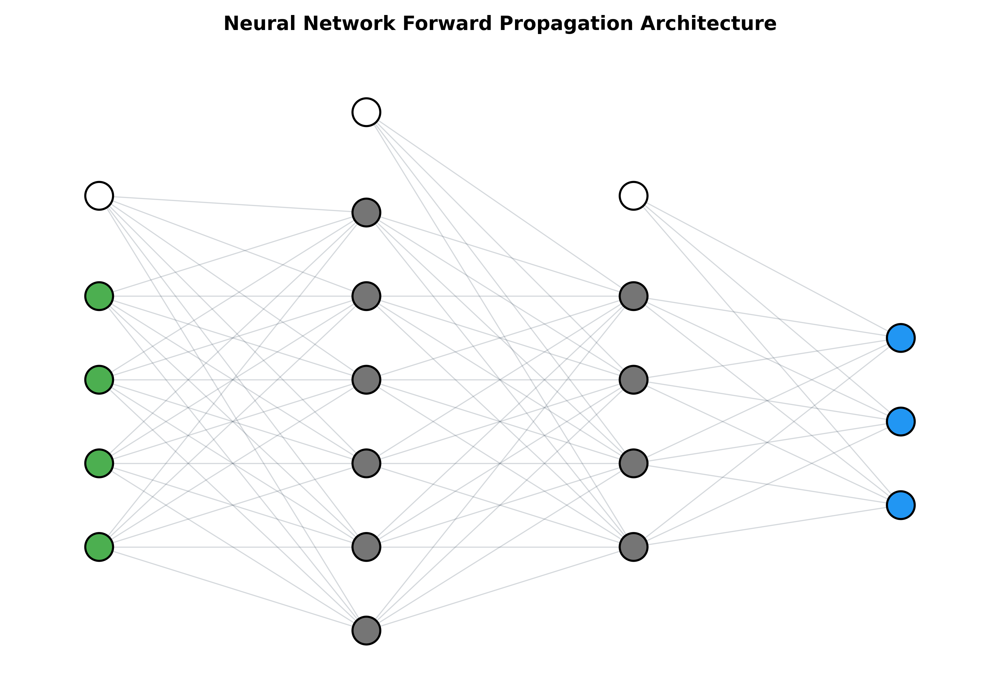
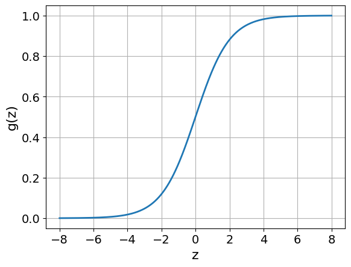

# Supplemental Material: Architecture and Forward Propagation

## Introduction

To support understanding how the neural network in my Python code is structured, and also to support the learning character of this project, I will explain the underlying structure and mathematics of the forward propagation of a particular neural network. Here we will follow one specific example and gradually generalize the derived rules. First, we should clarify some terminology. Our neural network architecture is shown below.

* **Figure 1:** *Example architecture of a feedforward neural network with one input layer, two hidden layers, and one output layer. The white neurons represent bias neurons fixed to the value 1. The green neurons correspond to the input layer, the gray neurons denote hidden layers, and the blue neurons form the output layer.*

The small dots are called *neurons*. They are arranged in columns called *layers*. The leftmost layer (green) is the **Input Layer (IL)**, which later contains the input data. The rightmost layer is the **Output Layer**, which we will later denote by $h$, since it represents the hypothesis of the network. The layers in between are the **Hidden Layers**. Personally, I prefer to label the layers by $l$ and enumerate them beginning with the input layer $l = 0$ and ending with the output layer $l = L - 1$ (where, in this example, $L = 4$). 

Each neuron represents a real number. While the colored dots correspond to variable values, the white dots (the *bias neurons*) are fixed to the value 1. The neurons are denoted by $a_i^l$, where $l = 0, \ldots, L-1$ specifies the layer and $i$ denotes the position of the neuron inside the layer. Note that each layer may contain a different number of neurons.

---

## Forward Propagation

Each input consists of a set of four values (note that the bias neuron is fixed to one and therefore does not count as an input). Let us denote the input by $x_i$. As illustrated in Figure 1, each neuron of the input layer ($l = 0$) is connected to every neuron of the first hidden layer ($l = 1$) through the depicted lines, which represent the so-called *weights* $\theta$. 

Each neuron of the first hidden layer (except the bias neuron) is calculated as the weighted sum of the neurons from the previous layer. For example, the second neuron of the first hidden layer computes

$$z_2 = 1 \cdot \theta_{0,2} + x_1 \cdot \theta_{1,2} + x_2 \cdot \theta_{2,2} + x_3 \cdot \theta_{3,2} + x_4 \cdot \theta_{4,2}$$

More generally,

$$z_i = \theta_{0,i} + \sum_j \theta_{j,i} x_j$$

Since we ultimately want to handle large data sets, we do not restrict ourselves to a single input tuple but instead consider an entire batch of $M$ input tuples. For this purpose, let us introduce an additional index $m$, so that

$$z_{mi} = \theta_{0,i} + \sum_j \theta_{j,i} x_{mj}$$

Computationally, it is far more efficient to formulate this in terms of matrix and vector products. With a batch of $M$ input sets, we define the input matrix

$$X \in \mathrm{Mat}(M, I)$$

where $I$ is the number of input neurons (in our case $I = 4$). For example,

$$X = \begin{pmatrix} 1 & 2 & 7 & -4 \newline 2 & 1 & 2 & 1 \newline 8 & -2 & -7 & 0 \newline \vdots \end{pmatrix}$$

Now we must add the bias neuron. Recall that the bias neuron has the fixed value one and occupies the first (zeroth) position in the layer. Thus, we define an $M \times (I+1)$ matrix $\tilde{X}$, where the first entry of each input is one:

$$\tilde{X} = \begin{pmatrix} 1 & 1 & 2 & 7 & -4 \newline 1 & 2 & 1 & 2 & 1 \newline 1 & 8 & -2 & -7 & 0 \newline \vdots \end{pmatrix}$$

With this notation, we can rewrite the previous expression for $z$ as

$$z_{mi} = \theta_{0,i} + \sum_{j=0}^{I-1} \theta_{j+1,i} x_{mj} = \sum_{j=0}^{I} \theta_{j,i} \tilde{x}_{mj} = (\tilde{X}\Theta)_{mi}$$

However, this only computes the intermediate value $z$. The actual neuron value is obtained by applying an *activation function* $g(z)$ to each value $z_{mi}$. In principle, many different activation functions are possible, but here we will use the sigmoid function

$$g(z) = \frac{1}{1 + e^{-z}}$$

which has the useful mathematical property:

$$g'(z) = g(z)(1-g(z))$$

This function takes values strictly between zero and one.

* **Figure 2:** *Example plot of the Sigmoid function, showing how it only results in values between zero and one.*

Finally, we can compute the neuron activations. Note that, in contrast to the notation introduced earlier, the neuron now carries two lower indices to account for the dataset sample:

$$a_{mi}^{l=1} = g(z_{mi})$$

Since we want to perform the same computation for arbitrary layers, we should formulate this as a general rule. From the previous equations we obtain, for an arbitrary layer $l$, neuron position $i$, and data set index $m$,

$$z_{mi}^l = \sum_{j=0}^{J} \theta_{ji}^l \tilde{a}_{mj}^{l-1}$$

or, in matrix notation,

$$Z^l = \tilde{A}^{l-1}\Theta^l$$

The corresponding neuron activations are then given by

$$A^l = g(Z^l)$$

Here, $A^0 = X$, and the construction of the augmented layer $\tilde{A}^l$ follows exactly the same column-prepending procedure described above.

---

## Example: One Forward Propagation Step

Let us now calculate one complete forward propagation step through our network, layer by layer, assuming a batch of 200 input sets ($M=200$).

1. The network has four input neurons, which means $X = A^0$ is a $200 \times 4$ matrix. 
2. Next, we add the bias neuron and construct $\tilde{A}^0$, which is therefore a $200 \times 5$ matrix. 
3. Since the next layer ($l = 1$) contains six neurons (excluding the bias neuron), the weight matrix between the first and second layer, $\Theta^{(1)}$, must be a $(4+1) \times 6$ matrix (a $5 \times 6$ matrix). 
4. The corresponding $z$-matrix is calculated as:
   $$Z^1 = \tilde{A}^0 \Theta^1$$
5. The neuron activations of the second layer are therefore:
   $$A^1 = g(Z^1)$$
   which yields a $200 \times 6$ matrix. 

In general, the matrix dimensions during execution are always:

$$\text{batch size} \times \text{number of neurons}$$

Finally, we again construct the augmented version $\tilde{A}^1$, which becomes a $200 \times 7$ matrix, ready to be multiplied by $\Theta^2$. This procedure is then repeated layer by layer until the final output layer is reached.
